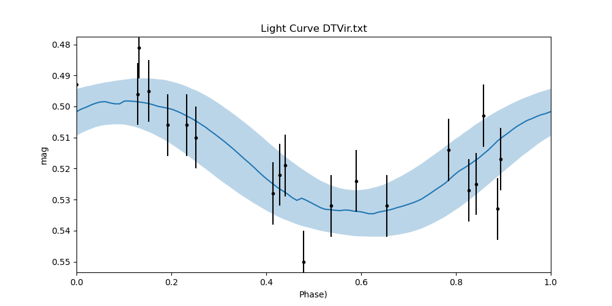

# AsPeng
Find period of variable star with uneven observation time interval.

Here's the result

Here's the result with uncertainty, assuiming the uncertainty in mag is 0.01

# LICENSE/Lisensi
GNU General Public License v3.0

see [LICENSE](LICENSE) file